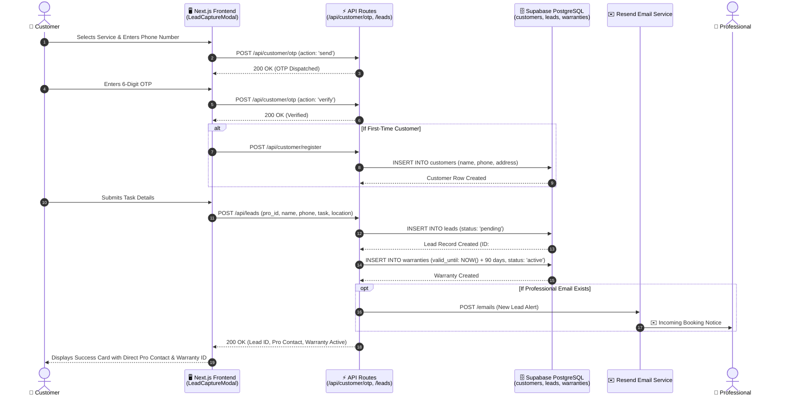
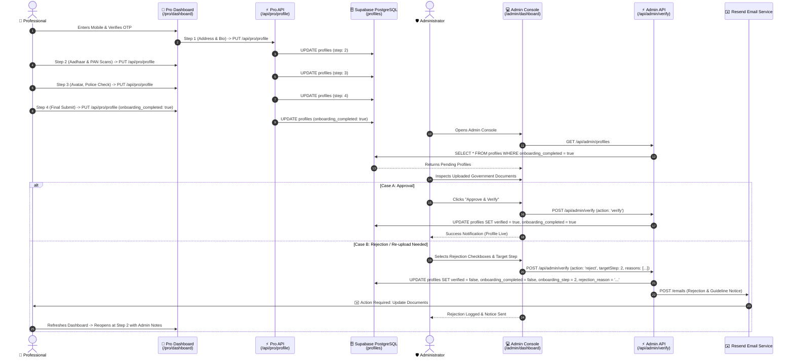
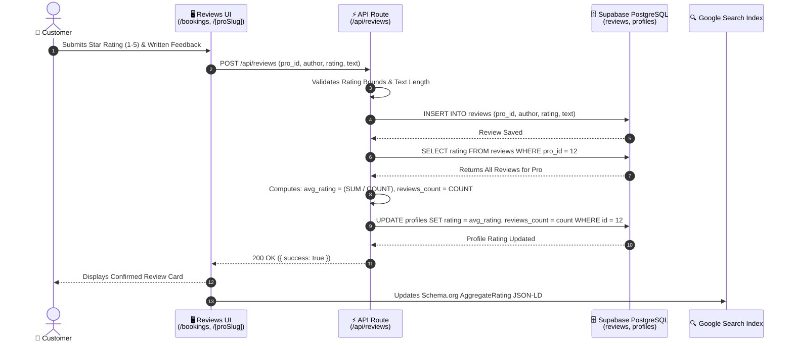
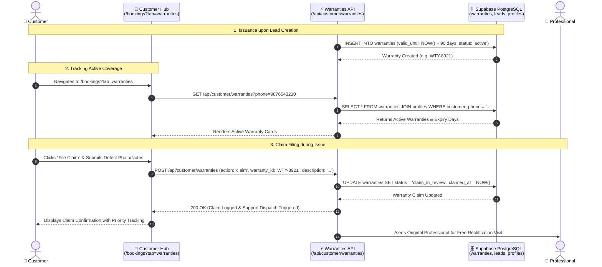

# Carpenterwala — Comprehensive Platform Journeys & Data Flows

This document details the **4 Core Platform Journeys** of the Carpenterwala ecosystem. It outlines every step, user interaction, frontend trigger, backend Next.js API route, Supabase PostgreSQL database transaction, and Resend email notification.

---

## Table of Contents
1. [Platform Architecture Summary](#platform-architecture-summary)
2. [Journey 1: Customer Journey (Lead Booking, OTP & Warranty Provisioning)](#journey-1-customer-journey)
3. [Journey 2: Service Professional Onboarding & Admin Audit Loop](#journey-2-service-professional-onboarding--admin-audit-loop)
4. [Journey 3: Review & Reputation Journey](#journey-3-review--reputation-journey)
5. [Journey 4: 90-Day Warranty Lifecycle Journey](#journey-4-90-day-warranty-lifecycle-journey)
6. [Master Database Tables & Entity Relationships](#master-database-tables--entity-relationships)

---

## Platform Architecture Summary

```
┌─────────────────────────────────────────────────────────────────────────────────────────┐
│                                   CLIENT LAYER                                          │
│  [Customer Browser]               [Pro Dashboard]                  [Admin Gatekeeper]   │
│  • Homepage / Services            • 4-Step Onboarding Wizard       • Document Inspector │
│  • LeadCaptureModal               • Document Scanner               • Verification Hub   │
│  • Booking / Warranty Hub         • Leads / Reviews Manager        • Rejection Dispatch │
└───────────────┬───────────────────────────┬───────────────────────────────┬─────────────┘
                │                           │                               │
                ▼                           ▼                               ▼
┌─────────────────────────────────────────────────────────────────────────────────────────┐
│                           NEXT.JS 16 APP ROUTER (API LAYER)                             │
│  • /api/customer/otp, /leads, /warranties       • /api/pro/auth, /profile, /verify-doc  │
│  • /api/reviews                                 • /api/admin/verify, /profiles, /leads  │
└───────────────┬───────────────────────────┬───────────────────────────────┬─────────────┘
                │                           │                               │
        ┌───────┴──────────────┐    ┌───────┴──────────────┐        ┌───────┴─────────────┐
        ▼                      ▼    ▼                      ▼        ▼                     ▼
┌───────────────────────────────┐ ┌─────────────────────────────────┐ ┌───────────────────┐
│     SUPABASE POSTGRESQL       │ │        RESEND EMAIL API         │ │ BROWSER STORAGE   │
│  • profiles    • leads        │ │  • Lead Alerts (Pro)            │ │ • localStorage    │
│  • customers   • warranties   │ │  • Rejection Notices (Pro)      │ │ • sessionStorage  │
│  • reviews     • blog_comments│ │  • Customer Status Notices      │ │ • Cookies / Auth  │
└───────────────────────────────┘ └─────────────────────────────────┘ └───────────────────┘
```

---

## Journey 1: Customer Journey
### (Discovery, Direct Contact, Lead Booking, OTP & Warranty Provisioning)

### 1. Overview
The customer journey enables homeowners in Bengaluru to discover verified carpenters, electricians, plumbers, and painters, contact them directly with zero platform commissions, verify their phone number via OTP, and receive an automatic 90-day Craftsmanship Warranty.

### 2. Step-by-Step Flow

#### Step 1.1: Discovery & Entry
- **Frontend**: Customer visits `/`, `/services/[service]/[location]`, `/find-a-professional`, or `/[proSlug]`.
- **User Action**: Clicks "Book Direct", "Call Now", or "Get Free Estimate".
- **Trigger**: Opens `LeadCaptureModal` or `DirectCallModal`.

#### Step 1.2: OTP Request & Dispatch
- **Endpoint**: `POST /api/customer/otp`
- **Payload**:
  ```json
  {
    "phone": "9876543210",
    "action": "send"
  }
  ```
- **Backend Action**:
  - Validates 10-digit Indian mobile format (`/^[6-9]\d{9}$/`).
  - Generates 6-digit OTP (e.g. `123456` in testing / SMS gateway).
- **Response**:
  ```json
  { "success": true, "message": "OTP sent successfully" }
  ```

#### Step 1.3: OTP Verification & Auto-Registration
- **Endpoint**: `POST /api/customer/otp`
- **Payload**:
  ```json
  {
    "phone": "9876543210",
    "otp": "123456",
    "action": "verify"
  }
  ```
- **Backend Action**:
  - Verifies OTP match.
  - Checks if record exists in `customers` table.
- **If New Customer**:
  - **Endpoint**: `POST /api/customer/register`
  - **Payload**:
    ```json
    {
      "name": "Rohan Sharma",
      "phone": "9876543210",
      "address": "4th Block, Koramangala, Bengaluru"
    }
    ```
  - **DB Action**: `INSERT INTO customers (name, phone, address, created_at)`
- **Client Action**: Stores `customer_phone` and `customer_name` in `localStorage`.

#### Step 1.4: Lead Creation & Professional Notification
- **Endpoint**: `POST /api/leads` (or `POST /api/customer/leads`)
- **Payload**:
  ```json
  {
    "pro_id": 12,
    "name": "Rohan Sharma",
    "phone": "9876543210",
    "task": "Custom TV unit wardrobe installation and hinge alignment",
    "location": "Koramangala, Bangalore"
  }
  ```
- **DB Action**:
  ```sql
  INSERT INTO leads (pro_id, name, phone, task, location, status, created_at)
  VALUES (12, 'Rohan Sharma', '9876543210', 'Custom TV unit...', 'Koramangala, Bangalore', 'pending', NOW())
  RETURNING id;
  ```
- **Resend Email Service**:
  - Checks if assigned professional has an email address registered in `profiles.email`.
  - Dispatches immediate email notification with customer task summary and direct call button.

#### Step 1.5: Automatic 90-Day Craftsmanship Warranty Provisioning
- **Endpoint**: `POST /api/customer/warranties`
- **DB Action**:
  ```sql
  INSERT INTO warranties (customer_phone, pro_id, lead_id, service_type, valid_until, status, created_at)
  VALUES ('9876543210', 12, lead_id, 'Carpentry', NOW() + INTERVAL '90 days', 'active', NOW());
  ```
- **Frontend Feedback**: Modal displays confirmation with Direct Pro phone number, WhatsApp link, and Warranty ID. Customer can track bookings anytime at `/bookings`.

### 3. Mermaid Sequence Diagram: Customer Journey



---

## Journey 2: Service Professional Onboarding & Admin Audit Loop
### (Pro Auth, 4-Step Document Scanner Wizard, Admin Audit & Rejection Loop)

### 1. Overview
Empowers service professionals (carpenters, painters, plumbers, electricians) to register, complete digital identity checks (Aadhaar, PAN, Police Verification), receive admin audits, and manage incoming leads with zero commission deductions.

### 2. Step-by-Step Flow

#### Step 2.1: Pro Authentication & Auto-Provisioning
- **Frontend**: Pro navigates to `/pro/login`.
- **Endpoints**:
  - Request OTP: `POST /api/pro/otp` (`action: 'send'`, `phone: '9548945949'`)
  - Verify OTP: `POST /api/pro/otp` (`action: 'verify'`, `phone: '9548945949'`, `otp: '123456'`)
- **DB Action**:
  - Checks if phone exists in `profiles`.
  - If new: creates profile record with unique slug (`SET onboarding_step = 1, onboarding_completed = false, verified = false`).
- **Client Session**: Stores `pro_info` in `localStorage`.

#### Step 2.2: 4-Step Onboarding Wizard (`/pro/dashboard`)
1. **Step 1: Contact & Address**:
   - Fields: `name`, `trade`, `phone`, `experience`, `full_address`, `about`
   - Endpoint: `PUT /api/pro/profile` -> sets `onboarding_step: 2`
2. **Step 2: Identity Documents (Aadhaar & PAN)**:
   - Client captures photo or uploads files (`aadhaar_front`, `aadhaar_back`, `pan_front`).
   - Image scanned for clarity & dimensions via client/server scanner (`POST /api/pro/verify-doc`).
   - Endpoint: `PUT /api/pro/profile` -> sets `onboarding_step: 3`
3. **Step 3: Background Verification & Portrait Avatar**:
   - Captures front portrait (`avatar`), Voter ID / Driving License (`voter_driving_front`), and Police Verification Certificate (`police_verification`).
   - Endpoint: `PUT /api/pro/profile` -> sets `onboarding_step: 4`
4. **Step 4: Final Review & Submission**:
   - Endpoint: `PUT /api/pro/profile`
   - Payload: `{ "onboarding_completed": true, "rejection_reason": null }`
   - DB Action: `UPDATE profiles SET onboarding_completed = true, rejection_reason = NULL WHERE id = proId`
   - Profile state transitions to **Awaiting Admin Review**.

#### Step 2.3: Admin Audit & Verification (`/admin/dashboard`)
- **Admin Authentication**:
  - Admin enters secure password -> `POST /api/admin/login` -> returns session token.
- **Fetch Queue**: `GET /api/admin/profiles` (filters `onboarding_completed === true && !verified`).
- **Document Inspection**:
  - Admin opens Document Audit Modal to inspect high-resolution scans of Aadhaar, PAN, Voter ID, and Police Certificate.

#### Step 2.4: Admin Verification Actions

##### Option A: Approve & Verify
- **Endpoint**: `POST /api/admin/verify`
- **Payload**: `{ "proId": 12, "action": "verify" }`
- **DB Action**: `UPDATE profiles SET verified = true, onboarding_completed = true, rejection_reason = NULL WHERE id = 12`
- **Outcome**: Pro profile is instantly published and listed on `/services`, search results, and location directory.

##### Option B: Decline & Request Re-upload (Rejection Loop)
- **Endpoint**: `POST /api/admin/verify`
- **Payload**:
  ```json
  {
    "proId": 12,
    "action": "reject",
    "reasons": [
      "Blurry / unreadable Aadhaar card front photo",
      "Police Verification certificate is missing or expired"
    ],
    "customMessage": "Please capture a flat photo in bright lighting.",
    "targetStep": 2
  }
  ```
- **DB Action**:
  ```sql
  UPDATE profiles 
  SET verified = false, 
      onboarding_completed = false, 
      onboarding_step = 2, 
      rejection_reason = 'Blurry / unreadable Aadhaar card... — Please capture a flat photo in bright lighting.'
  WHERE id = 12;
  ```
- **Resend Notification Email**:
  - Automatically dispatches formal HTML notice to `profile.email` with document guidelines and direct resubmit link (`https://carpenterwala.com/pro/login`).
- **Pro Re-submission**:
  - Pro opens `/pro/dashboard` -> sees high-priority amber alert with Admin Feedback.
  - Wizard automatically reopens at **Step 2** allowing them to replace only the defective images without retyping existing data.

### 3. Mermaid Sequence Diagram: Pro Onboarding & Audit



---

## Journey 3: Review & Reputation Journey
### (Customer Review Submission, Real-time Rating Recalculation & Schema.org Rich Results)

### 1. Overview
Enables verified customers who completed service bookings to evaluate craftsmen with 1–5 star ratings and reviews. Automatically recomputes the professional's aggregate rating and updates their public Google SEO rich snippets.

### 2. Step-by-Step Flow

#### Step 3.1: Review Submission
- **Frontend**: Customer visits `/bookings?tab=reviews` or Pro profile `/[proSlug]`.
- **Endpoint**: `POST /api/reviews`
- **Payload**:
  ```json
  {
    "pro_id": 12,
    "author": "Anjali Mehta",
    "rating": 5,
    "text": "Punctual, excellent finish on our custom TV unit wardrobe hinges. Highly recommended!",
    "customer_phone": "9876543210"
  }
  ```

#### Step 3.2: Validation & Database Persistence
- **Backend Validation**:
  - Validates `1 <= rating <= 5`.
  - Ensures author name and review text are provided.
- **DB Action 1 (Insert Review)**:
  ```sql
  INSERT INTO reviews (pro_id, author, rating, text, created_at)
  VALUES (12, 'Anjali Mehta', 5, 'Punctual, excellent finish...', NOW());
  ```

#### Step 3.3: Aggregate Rating Recalculation
- **DB Action 2 (Recalculate Average)**:
  ```sql
  SELECT rating FROM reviews WHERE pro_id = 12;
  -- Computes: total_reviews = count, avg_rating = sum / count
  
  UPDATE profiles 
  SET rating = 4.9, 
      reviews_count = reviews_count + 1 
  WHERE id = 12;
  ```

#### Step 3.4: Real-time Public Profile & SEO Rich Result Update
- **Profile Rendering**: `/[proSlug]` updates with newly added review card and updated star badge.
- **Structured Data**: Injects updated Schema.org `AggregateRating` JSON-LD for Google Search:
  ```json
  {
    "@context": "https://schema.org",
    "@type": "HomeAndConstructionBusiness",
    "name": "Anji Painter",
    "aggregateRating": {
      "@type": "AggregateRating",
      "ratingValue": "4.9",
      "reviewCount": "18",
      "bestRating": "5",
      "worstRating": "1"
    }
  }
  ```

### 3. Mermaid Sequence Diagram: Review Journey



---

## Journey 4: 90-Day Warranty Lifecycle Journey
### (Automatic Issuance, Status Tracking, Claim Filing & Defect Rectification)

### 1. Overview
Guarantees craftsmanship standards for all services booked through Carpenterwala with a complimentary **90-Day Craftsmanship Warranty** covering hinge alignment, paint peeling, joint stability, and plumbing seals.

### 2. Step-by-Step Flow

#### Step 4.1: Automatic Warranty Generation
- **Trigger**: When customer lead is created or booked with a verified pro.
- **Endpoint**: `POST /api/customer/warranties`
- **DB Action**:
  ```sql
  INSERT INTO warranties (
    customer_phone, 
    pro_id, 
    lead_id, 
    service_type, 
    issue_date, 
    valid_until, 
    status, 
    created_at
  ) VALUES (
    '9876543210', 
    12, 
    1042, 
    'Carpentry', 
    NOW(), 
    NOW() + INTERVAL '90 days', 
    'active', 
    NOW()
  );
  ```

#### Step 4.2: Customer Warranty Lookup & Tracking
- **Frontend**: Customer visits `/bookings?tab=warranties`.
- **Endpoint**: `GET /api/customer/warranties?phone=9876543210`
- **Backend Action**:
  - Fetches all warranties linked to phone number with joined pro details (`profiles.name`, `profiles.trade`, `profiles.phone`).
- **Response**:
  ```json
  {
    "warranties": [
      {
        "id": "WTY-8921",
        "service_type": "Carpentry",
        "valid_until": "2026-11-22T00:00:00Z",
        "status": "active",
        "days_remaining": 89,
        "profiles": { "name": "Anji Painter", "phone": "9548945949" }
      }
    ]
  }
  ```

#### Step 4.3: Warranty Claim Filing
- **User Action**: If an issue arises during warranty window, customer clicks **"File Warranty Claim"**.
- **Endpoint**: `POST /api/customer/warranties`
- **Payload**:
  ```json
  {
    "action": "claim",
    "warranty_id": "WTY-8921",
    "description": "Cabinet hinge became loose after 3 weeks of usage",
    "preferred_slot": "Tomorrow afternoon"
  }
  ```
- **DB Action**:
  ```sql
  UPDATE warranties 
  SET status = 'claim_in_review', 
      claim_details = 'Cabinet hinge became loose...', 
      claimed_at = NOW() 
  WHERE id = 'WTY-8921';
  ```

#### Step 4.4: Resolution & Re-dispatch
- **Platform Action**:
  - Re-routes priority service request to original verified pro or customer support.
  - Once defect is inspected and fixed: status transitions from `'claim_in_review'` -> `'resolved'`.

### 3. Mermaid Sequence Diagram: Warranty Lifecycle



---

## Master Database Tables & Entity Relationships

| Table Name | Primary Purpose | Key Columns |
| :--- | :--- | :--- |
| `profiles` | Stores verified handyman profiles, identity scans, & verification states | `id`, `slug`, `name`, `email`, `phone`, `trade`, `rating`, `reviews_count`, `full_address`, `aadhaar_front`, `aadhaar_back`, `pan_front`, `voter_driving_front`, `police_verification`, `verified`, `onboarding_completed`, `onboarding_step`, `rejection_reason`, `pending_avatar`, `accepting_leads` |
| `customers` | Registered customer directory and primary contact information | `id`, `name`, `phone`, `address`, `created_at` |
| `leads` | Customer service inquiries and direct booking requests | `id`, `pro_id`, `customer_id`, `name`, `phone`, `task`, `location`, `status`, `created_at` |
| `warranties` | 90-day craftsmanship warranty contracts and claim states | `id`, `customer_phone`, `pro_id`, `lead_id`, `service_type`, `issue_date`, `valid_until`, `status`, `claim_details`, `claimed_at` |
| `reviews` | Customer ratings, reviews, and author feedback | `id`, `pro_id`, `author`, `rating`, `text`, `customer_phone`, `created_at` |
| `blog_comments` | Discussion threads and reactions on carpentry guide articles | `id`, `post_slug`, `author_name`, `comment_text`, `parent_id`, `created_at` |

---

*Carpenterwala Architecture Blueprint • Maintained for Pair Programming & Visual Diagram Generation*
