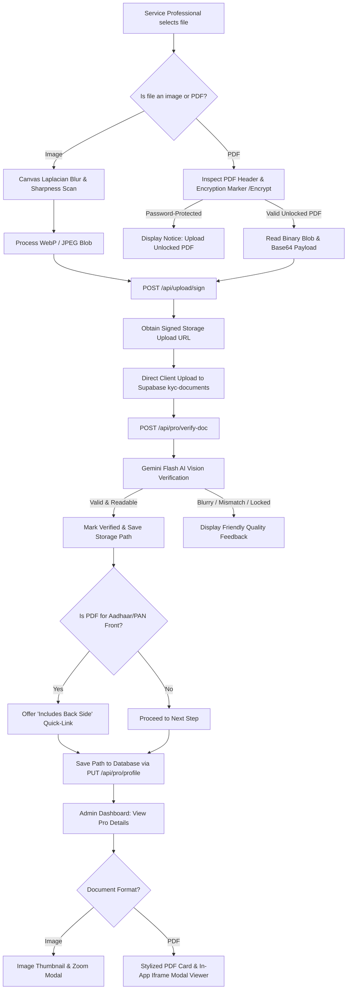

# Service Professional PDF Document Upload Walkthrough & Implementation Plan

## 1. Executive Summary

This walkthrough document outlines the technical architecture, data flow, component designs, and step-by-step implementation plan for enabling **PDF document uploads** for service professionals on Carpenterwala.

Currently, the service professional onboarding and verification flow only accepts image files (`image/*`). Service professionals frequently have authentic, high-quality documents issued in **PDF format** (such as e-Aadhaar from UIDAI, digital e-PAN from the Income Tax Department, digital Voter ID / Driving License, and state Police Clearance Certificates). This implementation enables seamless PDF upload, client-side safety & password checking, Gemini AI Vision readability verification, smart unified front/back linking, and in-app embedded viewing across both the **Pro Dashboard** and the **Admin Audit Console**.

---

## 2. Key Architecture & Design Alignment

| Requirement | Implementation Decision | Rationale |
| :--- | :--- | :--- |
| **Allowed File Types** | `image/*` + `application/pdf` | Supports both camera snapshots and official digital PDFs up to 15MB. |
| **Storage Bucket** | Supabase `kyc-documents` (private bucket) | Already configured with `application/pdf` support in storage policies. |
| **Combined PDF Handling** | Smart Unified Auto-Link | If a pro uploads a PDF for "Aadhaar Front", they can check a single box (*"PDF contains both Front & Back"*) to automatically satisfy both sides. |
| **Password Protection** | Pre-flight byte detection + Gemini check | Detects UIDAI/encrypted PDFs and provides immediate friendly feedback to upload an unlocked copy. |
| **Preview Experience** | Stylized PDF Card + In-App Modal Viewer | Replaces broken `` tags with a rich PDF card and an embedded `<iframe />` / `<object />` modal viewer with an **Open Fullscreen / Download** fallback. |
| **AI Verification** | Gemini 1.5 Flash (`inline_data`) | Uses native PDF ingestion to verify authentic Indian government seals, text sharpness, and ID type. |

---

## 3. End-to-End System Data Flow



---

## 4. Step-by-Step Implementation Walkthrough

### Phase 1: Storage Authorization & Path Generation
**File:** [`app/api/upload/sign/route.js`](file:///c:/Users/Sachidanand.Singh/Downloads/CAR/carpenterwala-1/app/api/upload/sign/route.js)
- **Current Limitation:** The route assigns extension using:
  ```javascript
  const extension = fileType.includes('png') ? 'png' : fileType.includes('jpeg') || fileType.includes('jpg') ? 'jpg' : 'webp';
  ```
  This causes PDF uploads to receive a `.webp` extension in Supabase Storage.
- **Change:** Add explicit check for `fileType === 'application/pdf'` to assign `.pdf`:
  ```javascript
  const extension = fileType.includes('pdf')
    ? 'pdf'
    : fileType.includes('png')
      ? 'png'
      : fileType.includes('jpeg') || fileType.includes('jpg')
        ? 'jpg'
        : 'webp';
  ```

---

### Phase 2: Client-Side Upload Engine
**File:** [`lib/document-scanner.js`](file:///c:/Users/Sachidanand.Singh/Downloads/CAR/carpenterwala-1/lib/document-scanner.js)
- **Current Limitation:** `uploadImageToStorage` routes every file through `processDocumentImage`, which instantiates an HTML `<canvas>` and fails on binary PDF files.
- **Changes:**
  1. Add a helper function `isPdfFile(file)` to detect PDF MIME or `.pdf` extension.
  2. For PDF files:
     - Check file size against 15MB limit.
     - Read the initial chunk (first 10KB) to inspect for `/Encrypt` marker to detect password-locked e-Aadhaar files before uploading.
     - Create an Object URL for instant in-browser preview.
     - Read file as ArrayBuffer / Base64 to supply to the verification route.
  3. Send request to `/api/upload/sign` with `fileType: 'application/pdf'`.
  4. Perform direct binary upload of the PDF blob to Supabase Storage.

---

### Phase 3: AI Document Verification API
**File:** [`app/api/pro/verify-doc/route.js`](file:///c:/Users/Sachidanand.Singh/Downloads/CAR/carpenterwala-1/app/api/pro/verify-doc/route.js)
- **Current Limitation:** The route hardcodes `mime_type: 'image/jpeg'` for the Gemini inline data part:
  ```javascript
  inline_data: { mime_type: 'image/jpeg', data: base64Data }
  ```
- **Changes:**
  1. Accept `mimeType` in request body (defaults to `'image/jpeg'`, accepts `'application/pdf'`).
  2. Pass `mime_type: mimeType || 'image/jpeg'` to Gemini.
  3. Gemini 1.5 Flash natively parses up to 1000 pages of PDF documents, verifying UIDAI seals, PAN emblems, and state police stamps.
  4. If Gemini returns that the document is password-protected or encrypted, return `{ valid: false, readable: false, isLocked: true, reason: 'This PDF is password-protected. Please upload an unlocked PDF copy.' }`.

---

### Phase 4: Pro Dashboard & Onboarding Wizard
**File:** [`app/pro/dashboard/page.js`](file:///c:/Users/Sachidanand.Singh/Downloads/CAR/carpenterwala-1/app/pro/dashboard/page.js)
- **Changes:**
  1. **File Input Filters:**
     - Update all KYC `<input type="file" />` tags from `accept="image/*"` to `accept="image/*,application/pdf"`.
     - Update `handleFileChange` to allow both `image/*` and `application/pdf`.
  2. **Stylized PDF Slot Presentation in `DocUploadSlot`:**
     - Detect if `value` or `previewSrc` is a PDF (via `.pdf` in URL or data URI `data:application/pdf`).
     - If PDF: Render a PDF document card featuring a red PDF badge, document icon, file status, and a **"Preview PDF"** button.
     - If Image: Retain the responsive photo preview.
  3. **Unified Front/Back Option:**
     - When a PDF is uploaded for `aadhaar_front` or `pan_front`, render a quick-action switch:
       > 📄 *"This PDF contains both Front & Back"*
     - Toggling this populates `aadhaar_back` with the same PDF path and marks it verified.
  4. **Universal Preview Modal (`previewDocModal`):**
     - Define `handleOpenPreview({ title, src, isPdf })`.
     - In the modal, if `isPdf`, render an embedded `<iframe src={src} style={{ width: '100%', height: '70vh', border: 'none' }} />` along with an **"Open Fullscreen / Download"** button.

---

### Phase 5: Admin Review Console
**File:** [`app/admin/dashboard/page.js`](file:///c:/Users/Sachidanand.Singh/Downloads/CAR/carpenterwala-1/app/admin/dashboard/page.js)
- **Changes:**
  1. **Document Preview Cards:**
     - In the pro profile detail drawer, check if the document path ends with `.pdf`.
     - If PDF, render an interactive PDF card with a "View PDF Document" action instead of an `` tag.
  2. **Zoom / Audit Modal (`zoomedImage`):**
     - When an admin clicks a PDF document, open the modal with an embedded `<iframe src={resolveDisplayUrl(doc)} />` and a direct link to open the PDF in a new tab for deep inspection during verification.

---

## 5. Security & Edge Case Handling

1. **File Size Limits:**
   - Both client-side and Supabase Storage enforce a 15MB ceiling per document.
2. **Password-Protected PDFs:**
   - Pre-flight regex check on binary buffer for `/\/Encrypt\b/` flags password protection immediately without consuming AI API quotas.
3. **Malicious Content Prevention:**
   - Supabase private bucket storage policies ensure KYC documents are never publicly listable; only signed, time-limited URLs (15-minute expiry) are generated for viewing.
4. **Mobile Browser Compatibility:**
   - Embedded `<iframe />` PDF viewing can vary on older iOS / Android WebViews; the in-app modal includes an explicit **"Open in New Tab / Download"** button using `target="_blank"` and `rel="noopener noreferrer"`.

---

## 6. Verification & Test Plan

| Test Scenario | Expected Outcome |
| :--- | :--- |
| **Upload standard JPEG/PNG photo** | Compresses via canvas, passes blur check, uploads successfully. |
| **Upload standard 1-page e-Aadhaar PDF** | Bypasses canvas, passes Gemini PDF check, uploads with `.pdf` path. |
| **Upload password-protected PDF** | Caught instantly, displays clear notice asking for unlocked version. |
| **Front/Back smart linking** | Clicking "Contains both Front & Back" automatically satisfies the Back requirement. |
| **Pro Dashboard preview** | Opens in-app modal showing PDF contents and fullscreen link. |
| **Admin Dashboard verification** | Admin can inspect PDF in modal, approve pro, or decline with specific feedback. |
